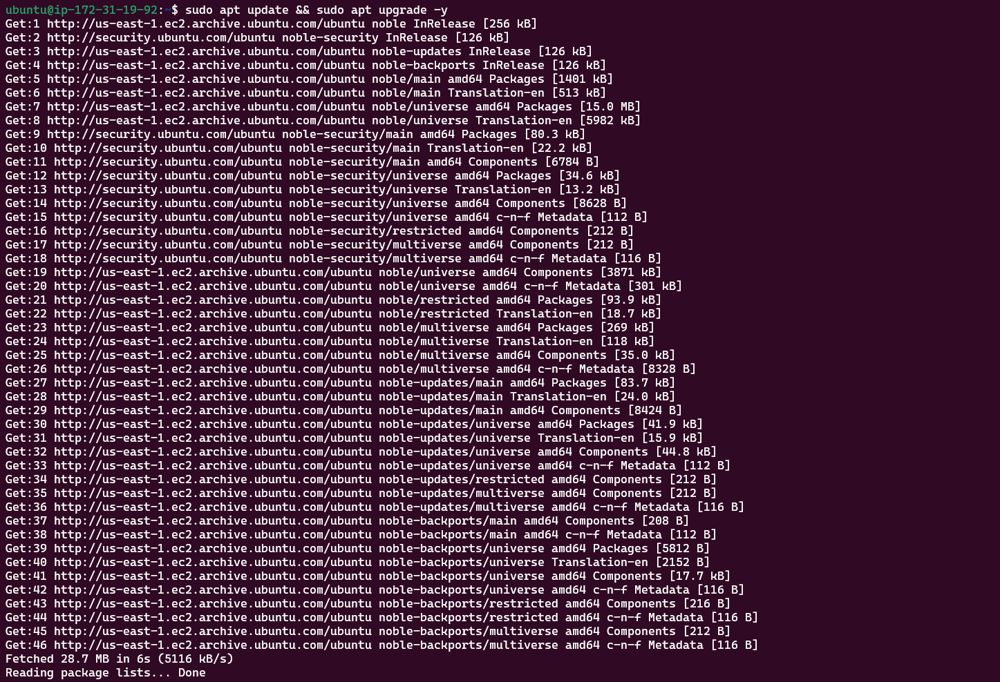

# Task - Implement a Client Server Architecture using MySQL Database Management System (DBMS)

I have demonstrated a basic Client-Server using MySQL RDBMS, with the following helpful instructions/steps.

### Step 1 - Create aand configure two Linux-based EC2 instances in AWS as shown in the screenshot below.

- Server A name - 'mysql server'
- Server B name - 'mysql client'


Update and upgrade Ubuntu

`sudo apt update && sudo apt upgrade -y`



### Step 2 - On mysl server Linux Server, I installed MySQL Server software by running the command.

`sudo apt install mysql-server -y`


Enable mysql server

`sudo systemctl enable mysql`


### Step 3 - On mysql client Linux Server, I installed MySQL Client software.

Update and upgrade Ubuntu

`sudo apt update && sudo apt upgrade -y`


Install MySQL Client software

`sudo apt install mysql-client -y`


### Step 4 - I used mysql server's local IP address to connect from mysql client.

By default, both of the EC2 virtual servers are located in the same local virtual network, so they can communicate to each other using local IP addresses. Use mysql server's local IP address to connect from mysql client. MySQL server uses TCP port 3306 by default so it has to be opened by creating a new entry in inbound rules in mysql server Security Groups. For extra security, access to mysql server by all IP addresses was not allowed, only the specific local IP address of mysql client was allowed.


### Step 5 - Configured MySQL server to allow connections from remote hosts.

Before the configuration stated above, the following were implemented:

The security script of MySQL was run on mysql server by running the command:

`sudo mysql_secure_installation`


Access MySQL shell by running the command.

`sudo mysql`


On mysql server, create a user named 'seyi' and a database named 'practice_db'.

```
CREATE USER 'seyi'@'%' IDENTIFIED WITH mysql_native_password BY 'password123$';

CREATE DATABASE practice_db;

GRANT ALL ON practice_db.* TO 'seyi'@'%' WITH GRANT OPTION;

FLUSH PRIVILEGES;
```


I went ahead to configure MySQL server to allow connections from remote hosts by running the command.

`sudo vim /etc/mysql/mysql.conf.d/mysqld.cnf`

Locate `bind-address = 127.0.0.1`

Replace `127.0.0.1 with 0.0.0.0`


### Step 6 - From mysql client Linxus Sever, connect remotely to mysql server Database Engine without using SSH. The mysql utility must be used to perform this action.

`sudo mysql -u client -h 172.31.18.141 -p`

### Step 7 - Check that the connection to the remote MySQL server was successfull and can perform SQL queries.

`show databases;`


In conclusion, I was able to access the mysql-server database from the mysql client server.
