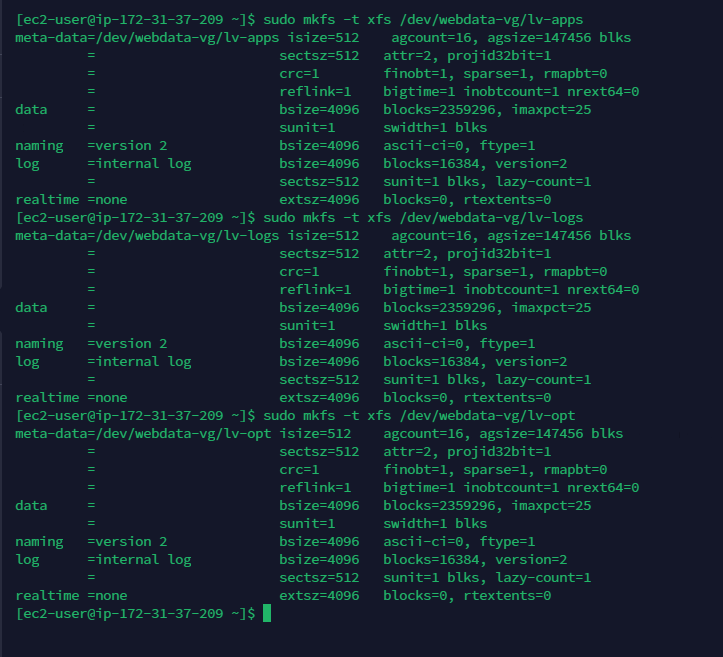
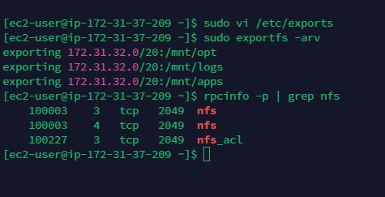
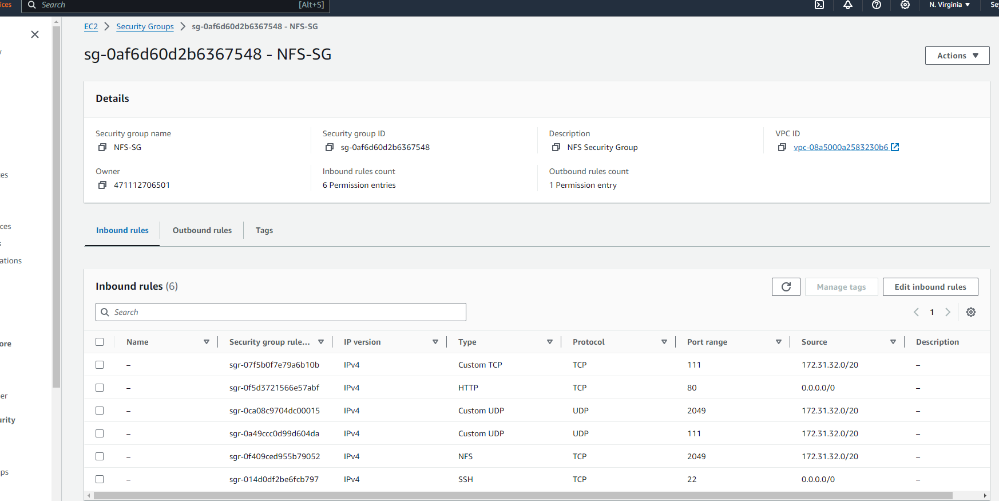

# DEVOPS TOOLING WEBSITE SOLUTION

## Step 1 - Prepare NFS Server

1. Spin up an EC2 instance with RHEL Operating System


2. Configure Logical volume management on the server

- Format the lvm as xfs

- Create 3 Logical volumes: lv-opt, lv-appa, lv-logs.

- Create mount points on /mnt directory for the logical volumes as follows:

  - Mount lv-apps on /mnt/apps - To be used by web servers.

  - Mount lv-logs on /mnt/logs - To be used by web server logs.

  - Mount lv-opt on /mnt/opt - To be used by Jenkins server in next project.

#### Create 3 volumes in the same AZ as the NFS Server ec2 each of 10GB and attache all 3 volumes one by one to the NFS Server.


#### Use lsblk to inspect what block devices are attached to the server. All devices in Linux reside in /dev/ directory. Inspect with ls /dev/ and ensure all 3 newly created devices are there.

`lsblk`


#### Use gdisk utility to create a single partition on each of the 3 disks

`sudo gdisk /dev/nvme3n1`


`sudo gdisk /dev/nvme1n1`


`sudo gisk /dev/nvme2n1`


#### Use lsblk utility to view the newly configured partitions on each of the 3 disks

`lsblk`


#### Install lvm package

`sudo yum install lvm2 -y`


#### Use pvcreate utility to mark each of the 3 dicks as physical volumes (PVs) to be used by LVM. Verify that each of the volumes have been created successfully

```
sudo pvcreate /dev/nvme3n1p1 /dev/nvme1n1p1 /dev/nvme2n1p1
sudo pvs
```

#### Use vgcreate utility to add all 3 PVs to a volume group (VG). Name the VG webdata-vg. Verify that the VG has been created successfully

```
sudo vgcreate webdata-vg /dev/nvme3n1p1 /dev/nvme1n1p1 /dev/nvme2n1p1
sudo vgs
```

#### Use lvcreate utility to create 3 logical volume, lv-apps, lv-logs and lv-opt. Verify that the logical volumes have been created successfully

```
sudo lvcreate -n lv-apps -L 9G webdata-vg
sudo lvcreate -n lv-logs -L 9G webdata-vg
sudo lvcreate -n lv-opt -L 9G webdata-vg

sudo lvs
```


#### Verify the entire setup

`sudo vgdisplay -v   #view complete setup, VG, PV and LV`


`lsblk`


#### Use mkfs -t xfs to format the logical volumes instead of ext4 filesystem

```
sudo mkfs -t xfs /dev/webdata-vg/lv-apps
sudo mkfs -t xfs /dev/webdata-vg/lv-logs
sudo mkfs -t xfs /dev/webdata-vg/lv-opt
```



#### Create mount point on /mnt directory

```
sudo mkdir /mnt/apps
sudo mkdir /mnt/logs
sudo mkdir /mnt/opt
```

```
sudo mount /dev/webdata-vg/lv-apps /mnt/apps
sudo mount /dev/webdata-vg/lv-logs /mnt/logs
sudo mount /dev/webdata-vg/lv-opt /mnt/opt
```


3. Install NFS Server, configure it to start on reboot and ensure it is up and running.

```
sudo yum update -y
sudo yum install nfs-utils -y
```


```
sudo systemctl start nfs-server.service
sudo systemctl enable nfs-server.service
sudo systemctl status nfs-server.service
```


4. Export the mounts for Webservers' subnet cidr(IPv4 cidr) to connect as clients. For simplicity, all 3 Web Servers are installed in the same subnet but in production set up, each tier should be separated inside its own subnet or higher level of security.

#### Set up permission that will allow the Web Servers to read, write and execute files on NFS.

```
sudo chown -R nobody: /mnt/apps
sudo chown -R nobody: /mnt/logs
sudo chown -R nobody: /mnt/opt

sudo chmod -R 777 /mnt/apps
sudo chmod -R 777 /mnt/logs
sudo chmod -R 777 /mnt/opt

sudo systemctl restart nfs-server.service
```


#### Configure access to NFS for clients within the same subnet

```
sudo vi /etc/exports

/mnt/apps 172.31.32.0/20(rw,sync,no_all_squash,no_root_squash)
/mnt/logs 172.31.32.0/20(rw,sync,no_all_squash,no_root_squash)
/mnt/opt 172.31.32.0/20(rw,sync,no_all_squash,no_root_squash)

sudo exportfs -arv
```


5. Check which port is used by NFS and open it using the security group (add new inbound rule)

`rpcinfo -p | grep nfs`



Note: For NFS Server to be accessible from the client, the following ports must be opened: TCP 111, UDP 111, UDP 2049, NFS 2049. Set the Web Server subnet cidr as the source



## Step 2 - Configure the Database Server

#### Launch 1 Ec2 instance on ubuntu OS

#### Ssh into it

#### Update and upgrade the instance

#### Install mysql server

`sudo apt install -y mysql-server`


#### Create db, user @ the subnet cidr, and grant all privileges to the user, It is essential to use the subnet cidr to ensure that all instances under that subnet can access the mysql database.

```
sudo mysql
CREATE DATABASE tooling;
CREATE USER 'webaccess'@'172.31.32.0/20' IDENTIFIED BY 'passw0rd123$';
GRANT ALL PRIVILEGES ON tooling.* TO 'webaccess'@'172.31.32.0/20';
FLUSH PRIVILEGES;
exit;
```


#### Edit the MySQL configuration file to bind it to all IP addresses, (0.0.0.0) Open the MySQL configuration file, which is located at /etc/mysql/mysql.conf.d/mysqld.cnf:


#### Go to your ec2 security group in bound rules and add the port 3306 (default mysql port) and allow access from your subnet cidr

## Step 3 - Prepare the Web Servers

There is need to ensure that the Web Servers can serve the same content from a shared storage solution, in this case - NFS and MySQL database. One DB can be accessed for read and write by multiple clients. For storing shared files that the Web Servers will use, NFS is utilized and previousely created Logical Volume lv-apps is mounted to the folder where Apache stores files to be served to the users (/var/www).

This approach makes the Web server stateless which means they can be replaced when needed and data (in the database and on NFS) integrtity is preserved

In further steps, the following was done:

- Configured NFS (This step was done on all 3 servers)

- Deployed a tooling application to the Web Servers into a shared NFS folder

- Configured the Web Server to work with a single MySQL database

#### Web Server 1

#### Launch a new EC2 instance with RHEL Operating System


#### Install NFS Client

`sudo yum install nfs-utils nfs4-acl-tools -y`


#### Mount /var/www/ and target the NFS server's export for apps. NFS Server private IP address = 172.31.37.209

```
sudo mkdir /var/www
sudo mount -t nfs -o rw,nosuid 172.31.37.209:/mnt/apps /var/www
```

#### Verify that NFS was mounted successfully by running df -h. Ensure that the changes will persist after reboot.


`sudo vi /etc/fstab`

Add the following line

`172.31.37.209:/mnt/apps /var/www nfs defaults 0 0`


#### Install and configure REMI repository, apache, as well as php and all dependencies

```
sudo yum install httpd -y

sudo dnf install https://dl.fedoraproject.org/pub/epel/epel-release-latest-9.noarch.rpm

sudo dnf install dnf-utils http://rpms.remirepo.net/enterprise/remi-release-9.rpm

sudo dnf module reset php

sudo dnf module enable php:remi-7.4

sudo dnf install php php-opcache php-gd php-curl php-mysqlnd

sudo systemctl start php-fpm

sudo systemctl enable php-fpm

sudo setsebool -P httpd_execmem 1  # Allows the Apache HTTP server (httpd) to execute memory that it can also write to. This is often needed for certain types of dynamic content and applications that may need to generate and execute code at runtime.

sudo setsebool -P httpd_can_network_connect=1   # Allows the Apache HTTP server to make network connections to other servers.

sudo setsebool -P httpd_can_network_connect_db=1  # allows the Apache HTTP server to connect to remote database servers.
```


#### Repeat the processes on the two other newly-created EC2 (RedHat) instances.

#### Verify that Apache files and directories are availabel on the Web Servers in /var/www and also on the NFS Server in /mnt/apps. If the same files are present in both, it means NFS was mounted correctly. test.txt file was created from Web Server 1, and it was accessible from Web Server 2.


#### Locate the log folder for Apache on the Web Server and mount it to NFS server's export for logs. Repeat step 4 to ensure the mount point persists after reboot.

`sudo vi /etc/fstab`

Add the following line

`172.31.1.209:/mnt/logs /var/log/httpd nfs defaults 0 0`


#### Fork the tooling source code from StegHub GitHub Account


#### Deploy the tooling Website's code to the Web Server. Ensure that the html folder from the repository is deplyed to /var/www/html

#### Install Git

#### Initialize the directory and clone the tooling repository

Ensure to clone the forked repository


#### Note : Access the website on a browser

- Ensure TCP port 80 is open on the Web Server.

- If 403 Error occur, check permissions to the /var/www/html folder and also disable SELinux

`sudo setenforce 0`

To make the change permanent, open selinux file and set selinux to disable.

```
sudo vi /etc/sysconfig/selinux

SELINUX=disabled

sudo systemctl restart httpd
```


#### Update the website's configuration to connect to the database (in /var/www/html/function.php file). Apply tooling-db.sql command sudo mysql -h <db-private-IP> -u <db-username> -p <db-password < tooling-db.sql

`sudo vi /var/www/html/functions.php`


`sudo mysql -h 172.31.39.179 -u webaccess -p tooling < tooling-db.sql`


#### Access the database server from Web Server

#### Install mysql client on web servers

`sudo yum install -y mysql`

`sudo mysql -h 172.31.39.179 -u webaccess -p`


#### Create in MyQSL a new admin user with username: myuser and password: password

`INSERT INTO users(id, username, password, email, user_type, status) VALUES (2, 'myuser', '5f4dcc3b5aa765d61d8327deb882cf99', 'user@mail.com', 'admin', '1');`


#### Open a browser and access the website using the Web Server public IP address http://<Web-Server-public-IP-address>/index.php. Ensure login into the website with myuser user.

#### From Web Server 1


#### log in using the username : myuser and password : password , which we created earlier


#### From Web Server 2

Disable SELinux

```
sudo setenforce 0

SELINUX=disabled
```

#### Access the website using the webservers <public-ip-address>/index.php on different web broswer tabs


