WEB STACK IMPLEMENTATION (LAMP STACK) IN AWS

Introduction:

The LAMP stack is a popular open-source web development platform that consists of four main components: Linux, Apache, MySQL, and PHP (or sometimes Perl or Python). This documentation outlines the setup, configuration, and usage of the LAMP stack.

Step 0: Prerequisites
1. EC2 Instance of t2.micro type and Ubuntu 24.04 LTS (HVM) was lunched in the us-east-1 region using the AWS console.

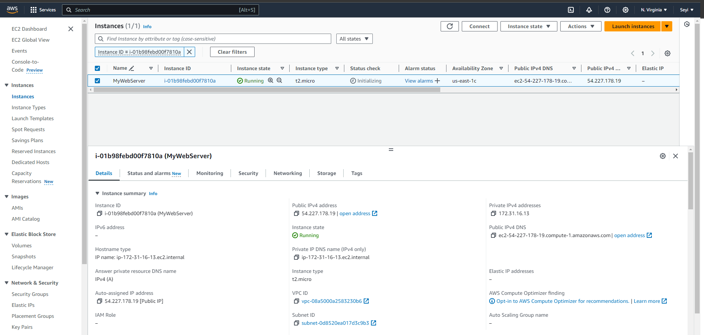

2. Created SSH key pair named lamp_ec2 to access the instance on port 22
3. The security group was configured with the following inbound rules:

Allow traffic on port 80 (HTTP) with source from anywhere on the internet.
Allow traffic on port 443 (HTTPS) with source from anywhere on the internet.
Allow traffic on port 22 (SSH) with source from any IP address. This is opened by default.

4. The default VPC and Subnet was used for the networking configuration.

5. The private ssh key that got downloaded was located, permission was changed for the private key file and then used to connect to the instance by running

chmod 400 lamp_ec2.pem
ssh -i "lamp_ec2.pem" ubuntu@54.227.178.19
Where username=ubuntu and public ip address=54.227.178.19

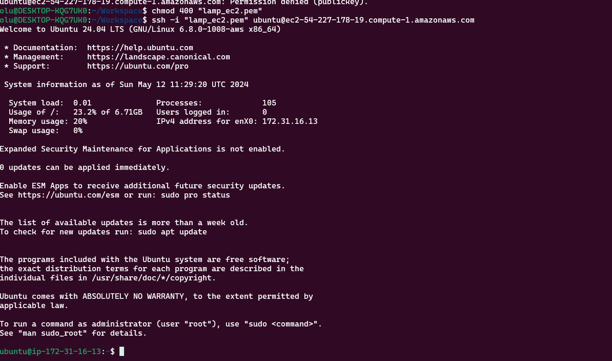

Step 1 - Install Apache and Update the Firewall

1. Update and upgrade list of packages in package manager

sudo apt update
sudo apt upgrade -y

2. Run apache2 package installation

sudo apt install apache2 -y

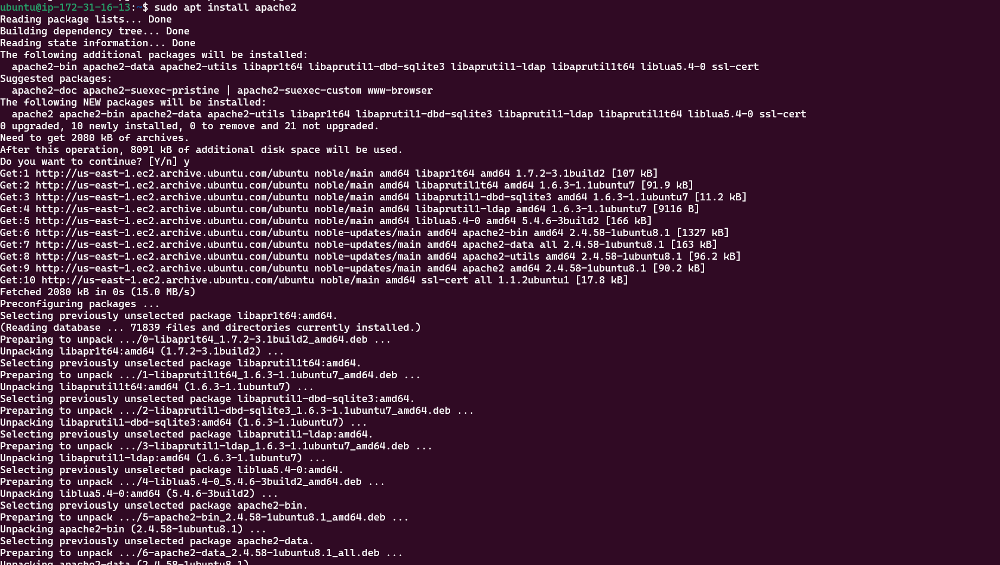

3. Enable and verify that apache is running on as a service on the OS.

sudo systemctl enable apache2
sudo systemctl status apache2

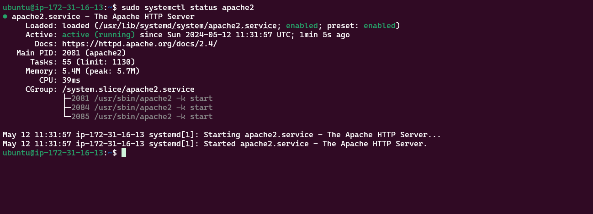

4. The server is running and can be accessed locally in the ubuntu shell by running the command below:

curl http://localhost:80
OR
curl http://127.0.0.1:80

5. Test with the public IP address if the Apache HTTP server can respond to request from the internet using the url on a browser.
Apache Default Page This shows that the web server is correctly installed and it is accessible through the firewall.

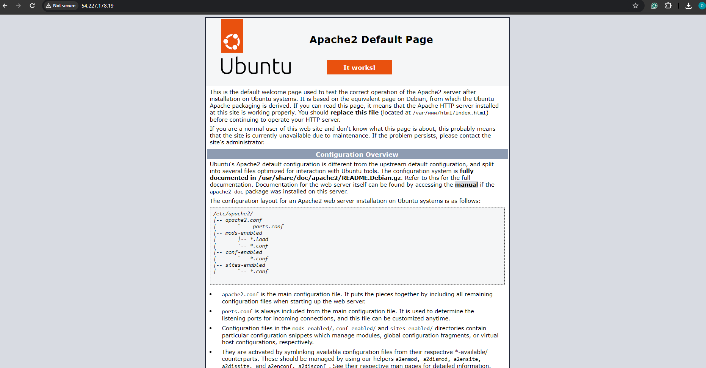

6. Another way to retrieve the public ip address other than check the aws console

curl -s http://169.254.169.254/latest/meta-data/public-ipv4
After running the command above, there was an error 401 - Unauthorized output. Unauthorized Error-401

In troubleshooting this error, the following navigation was made from the ec2 instance page on the AWS console:

Actions > Instance Settings > Modify instance metadata options.
Then change the IMDSv2 from Required to Optional.

Step 2 - Install MySQL
1. Install a relational database (RDB)

MySQL was installed in this project. It is a popular relational database management system used within PHP environments.

sudo apt install mysql-server
Install MySQL When prompted, install was confirmed by typing y and then Enter.

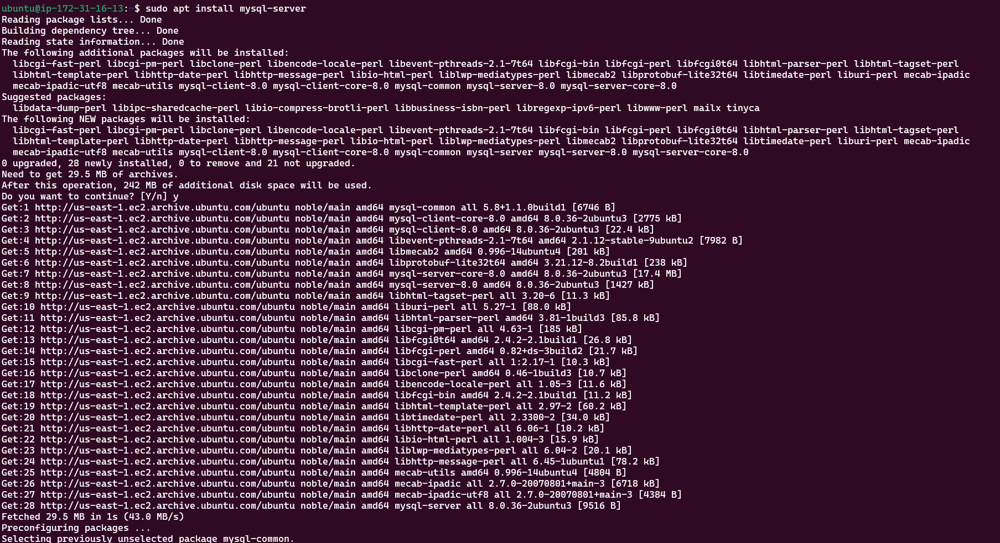

2. Enable and verify that mysql is running with the commands below

sudo systemctl enable --now mysql
sudo systemctl status mysql

3. Log in to mysql console

sudo mysql
This connects to the MySQL server as the administrative database user root infered by the use of sudo when running the command.

4. Set a password for root user using mysql_native_password as default authentication method.

Here, the user's password was defined as "Passw0rd123$"

ALTER USER 'root'@'localhost' IDENTIFIED WITH mysql_native_password BY 'Passw0rd123$';

exit

5. Run an Interactive script to secure MySQL
The security script comes pre-installed with mysql. This script removes some insecure settings and lock down access to the database system.
sudo mysql_secure_installation

Regardless of whether the VALIDATION PASSWORD PLUGIN is set up, the server will ask to select and confirm a password for MySQL root user.

6. After changing root user password, log in to MySQL console.

A command prompt for password was noticed after running the command below.

sudo mysql -p

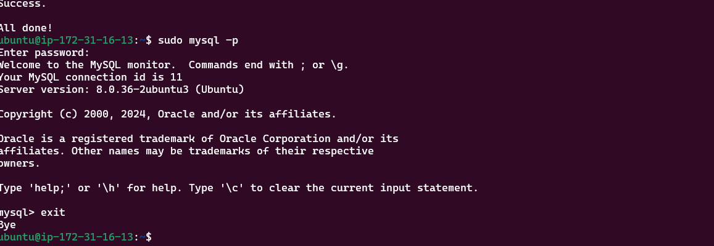

exit

Step 3 - Install PHP

1. Install php Apache is installed to serve the content and MySQL is installed to store and manage data. PHP is the component of the set up that processes code to display dynamic content to the end user.

The following were installed:

php package
php-mysql, a PHP module that allows PHP to communicate with MySQL-based databases.
libapache2-mod-php, to enable Apache to handle PHP files.
sudo apt install php libapache2-mod-php php-mysql
Install PHP

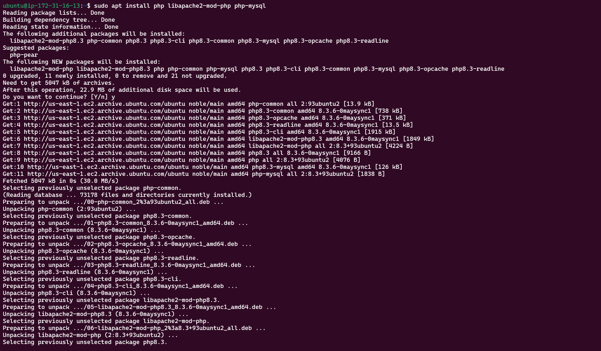

Confirm the PHP version

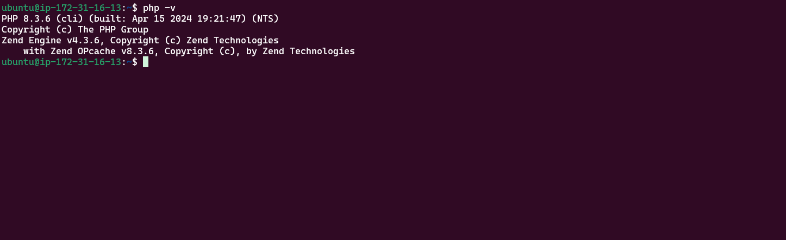

Step 4 - Create a virtual host for the website using Apache

1. The default directory serving the apache default page is /var/www/html. Create your document directory next to the default one.

Created the directory for projectlamp using "mkdir" command
sudo mkdir /var/www/projectlamp
Assign the directory ownership with $USER environment variable which references the current system user.
sudo chown -R $USER:$USER /var/www/projectlamp

2. Create and open a new configuration file in apache’s “sites-available” directory using vim.

sudo vim /etc/apache2/sites-available/projectlamp.conf
3. Show the new file in sites-available

sudo ls /etc/apache2/sites-available

With the VirtualHost configuration, Apache will serve projectlamp using /var/www/projectlamp as its web root directory.

4. Enable the new virtual host

sudo a2ensite projectlamp

5. Disable apache’s default website.

sudo a2dissite 000-default

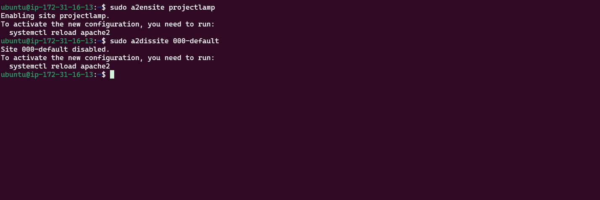

6. Ensure the configuration does not contain syntax error using the command below:

sudo apache2ctl configtest

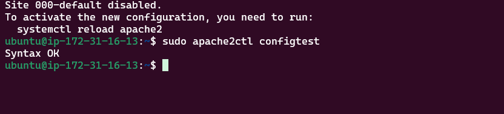

7. Reload apache for changes to take effect.
sudo systemctl reload apache2
8. The new website is now active but the web root /var/www/projectlamp is still empty. Create an index.html file in this location so to test the virtual host work as expected.

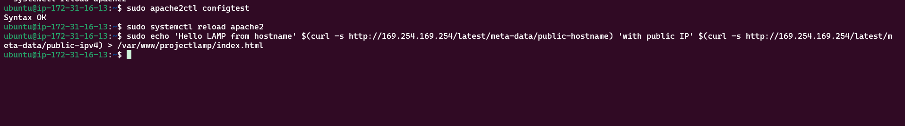

9. Open the website on a browser using the public IP address.
10. Open the website with public dns name (port is optional)
This file can be left in place as a temporary landing page for the application until an index.php file is set up to replace it. Once this is done, the index.html file should be renamed or removed from the document root as it will take precedence over index.php file by default.

Step 5 - Enable PHP on the website

1. Open the dir.conf file with vim to change the behaviour

sudo vim /etc/apache2/mods-enabled/dir.conf

2. Reload Apache
sudo systemctl reload apache2

3. Create a php test script to confirm that Apache is able to handle and process requests for PHP files.

A new index.php file was created inside the custom web root folder.

4. Now refresh the page

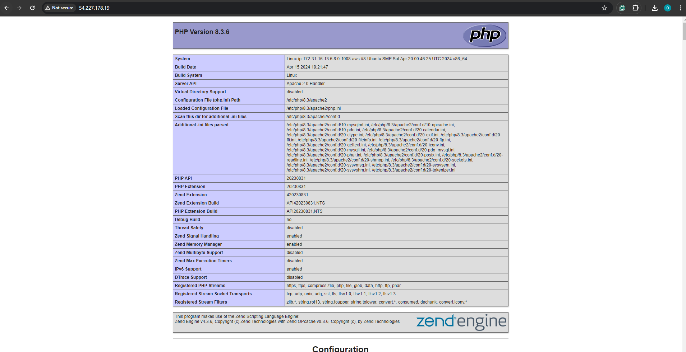

This page provides information about the server from the perspective of PHP. It is useful for debugging and to ensure the settings are being applied correctly.

After checking the relevant information about the server through this page, It’s best to remove the file created as it contains sensitive information about the PHP environment and the ubuntu server. It can always be recreated if the information is needed later.

sudo rm /var/www/projectlamp/index.php

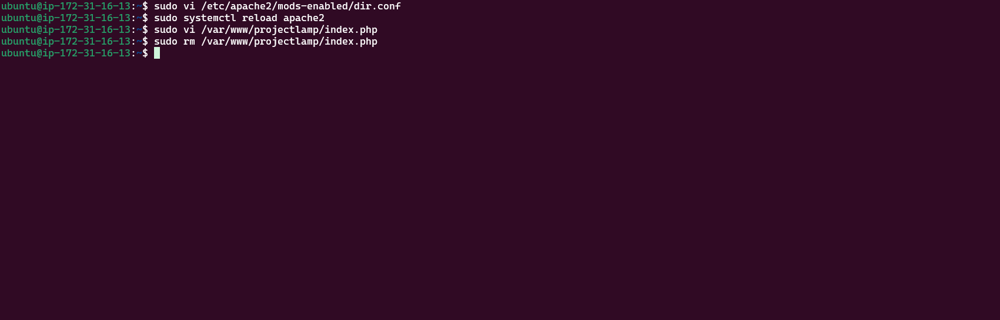

Conclusion:

The LAMP stack provides a robust and flexible platform for developing and deploying web applications. By following the guidelines outlined in this documentation, It was possible to set up, configure, and maintain a LAMP environment effectively, enabling the creation of powerful and scalable web solutions.

