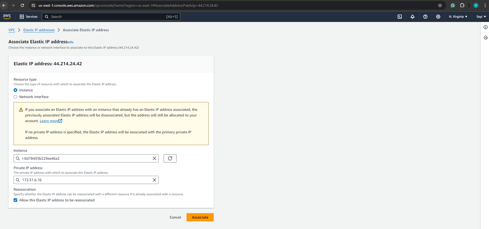
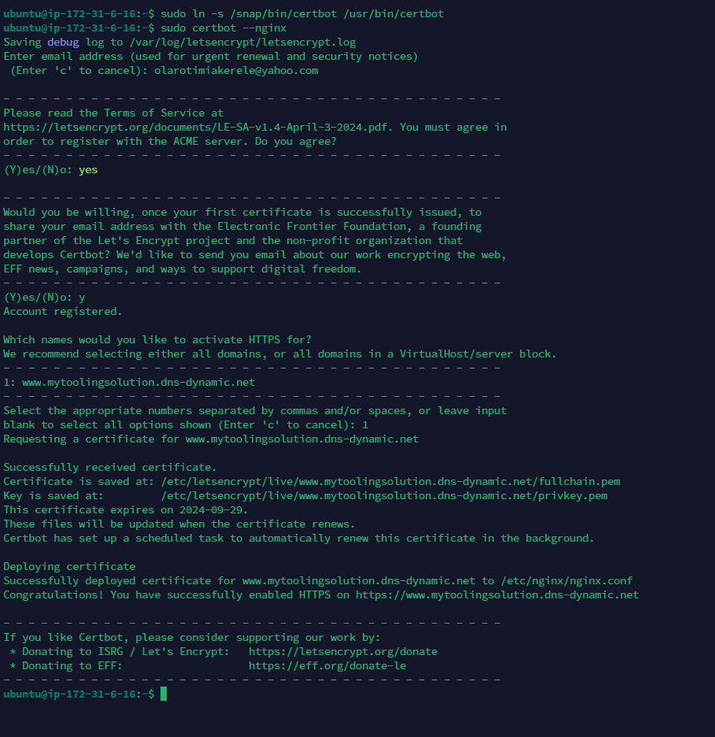
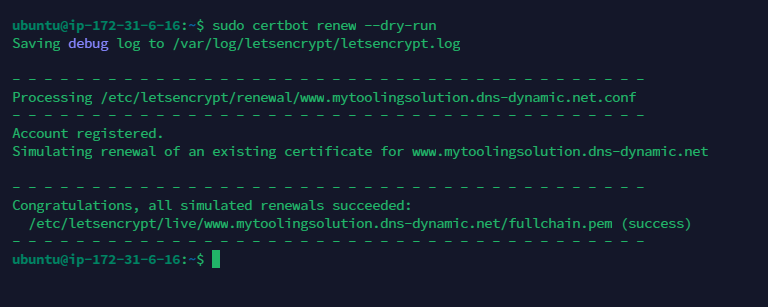

# Load Balancer Solution With Nginx and SSL/TLS

A Load Balancer (LB) distributes clients' requests among underlying Web Servers and makes sure that the load is distributed in an optimal way. In this project, we will configure an Nginx Load Balancer Solution.

It is extremely important to ensure that connections to our Web Solutions are secure and information is encrypted in transit. Connection over secured HTTP (HTTPS protocol), it's purpose and what is required to implement it will be covered.

### Task

This project consist of two parts:

- Configure Nginx as a Load Balancer

- Register a new domain name and configure secure connection

# Part 1 - Configue Nginx As A Load Balancer

### 1. Create an EC2 VM based on Ubuntu Server 24.04 LTS and name it nginx LB


#### Open TCP port 80 for HTTP connections and TCP port 443 for secured HTTPS connections


### 2. Update /etc/hosts file for local DNS with Web Servers' names (e.g web1 and web2) and their local IP addresses

Update the hosts file

`sudo vi /etc/hosts`


### 3. Install and configure Nginx as a load balancer to point traffic to the resolvable DNS names of the webservers

Update the instance

`sudo apt update && sudo apt upgrade -y`


#### Install Nginx

`sudo apt install nginx`


### 4. Configure Nginx LB using the Web Servers' name defined in /etc/hosts

#### Open the default Nginx configuration file

`sudo vi /etc/nginx/nginx.conf`

#### Insert the following configuration in http section

```
    upstream myproject {
       server Web1 weight=5;
       server Web2 weight=5;
    }

    server {
        listen 80;
        server_name ww.domain.com;

        location / {
            proxy_pass http://myproject;
        }
    }
    # comment out this line
    # include /ete/nginx/sites-enabled/
```


#### Test the server configuration

`sudo nginx -t`

#### Restart Nginx and ensure the service is up and running

```
sudo systemctl restart nginx
sudo systemctl status nginx
```


# Part 2 - Register a new domain name and configure secured connection using SSL/TLS certificates

In order to get a valid SSL certificate we need to register a new domain name, we can do it using any Domain name registrar - a company that manages reservation of domain names. The most popular ones are: Godaddy.com, Domain.com, Bluehost.com.

#### 1. Register a new domain name with any registrar of your choice in any domain zone. (e.g .com, .net, .org, .edu, info, .xyz or any other)

Cloudns.net is the domain name registrar used for this project.


#### 2. Assign an Elastic IP to our Nginx LB server and associate our domain name with this Elastic IP

This is neccessary in order to have a static IP address that does not change after reboot.


#### Associate the elastic IP with Nginx LB



#### 3. Update or create A record your registrar to point to Nginx LB using the elastic IP


use nds checker to verify the DNS record


#### 4. Configure Nginx to recognize your new domain name

Update your `nginx.conf` with `server_name www.<your-domain-name.com` instead of `server_name www.domain.com`

In our case, the server_name is `www.mytoolingsolution.dns-dynamic.net`

`sudo vi /etc/nginx/nginx.conf`


#### Restart Nginx

`sudo systemctl restart nginx`

#### Check that the Web Server can be reach from a browser with the new domain name using HTTP protocol.

`http://<your-domain-name.com>`


#### 5. Install certbot and request for an SSL/TLS certificate

#### Ensure snapd service is active and running

`sudo systemctl status snapd`


#### Install certbot

`sudo snap install --classic certbot`


### Request SSL/TLS Certificate

#### Create a Symlink in `/usr/bin` for Certbot: Place a symbolic link in this `PATH` to make it easier to run `certbot` from the `command line` without needing to specify its full path.

`sudo ln -s /snap/bin/certbot /usr/bin/certbot`

Follow the certbot instructions you will need to choose which domain you want your certificate to be issued for, domain name will be looked up from `nginx.conf` file so ensure you have updated it on step 4.

`sudo certbot --nginx  # Obtain certificate`



### Test secured access to your Web Solution by trying to reach https://<your-domain-name.com>.

You shall be able to access your wesite using HTTPS protocol (Uses `TCP port 443`) and see a padlock image in your browsers' search string. `Click on the padlock icon` and you can see the detail of the certificate issued for the website.


#### 6. Set up periodical renewal of your SSL/TLS certificate

By default, `LetsEncrypt` certificate is valid for 90 days, so it is recommended to renew it at least every 60 days or more frequently.

#### Test the renewal command in `dry-run` mode

`sudo certbot renew --dry-run`



#### Best pracice is to have a scheduled job that runs `renew` command periodically. Configure a `cronjob` to run the command twice a day

#### Edit the `crontab` file

`crontab -e  `

#### Add the following line to scheduled a job that runs renew command twice daily

`* */12 * * *   root /usr/bin/certbot renew > /dev/null 2>&1   `


