Step 0 - Preparing prerequisites

I created an AWS instance which I will be using to implement a simple Book Register web form using MERN stack.

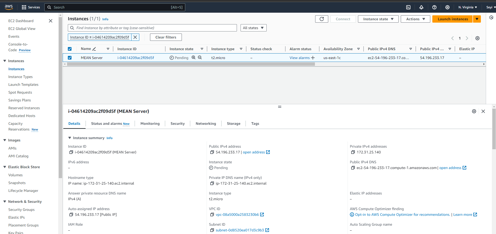

Step 1: Install NodeJs

I ran the following commands to update aand upgrade the Ubuntu package.

$ sudo apt upgrade && sudo apt upgrade -y

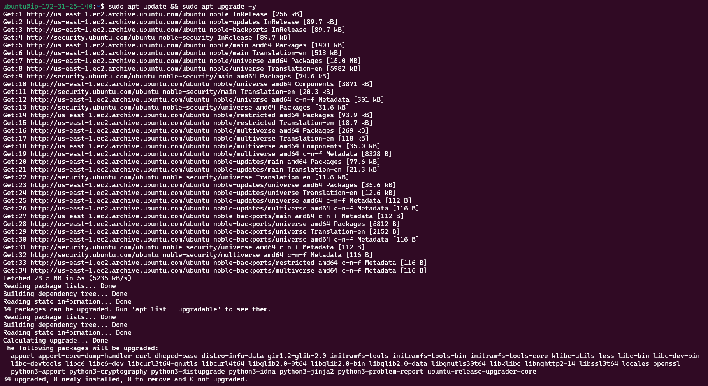

Add certificates

$ sudo apt -y install curl dirmngr apt-transport-https lsb-release ca-certificates

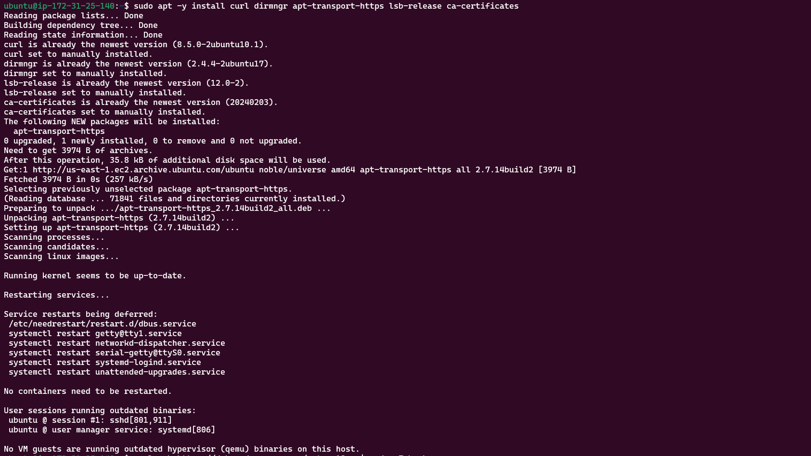

$ curl -sL https://deb.nodesource.com/setup_18.x | sudo -E bash -

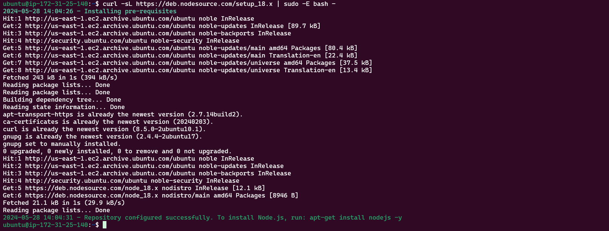

Install NodJS

$ sudo apt install -y nodejs

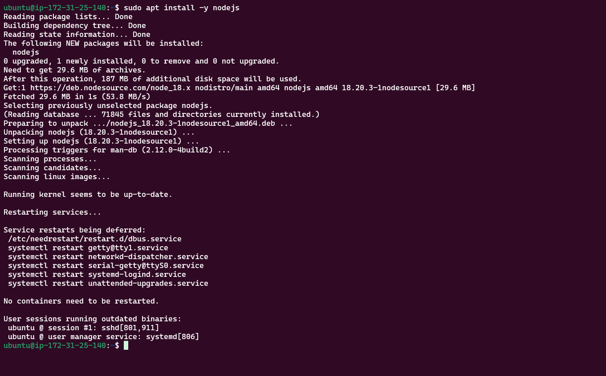

Step 2: Install MongoDB

For this application, Book records were added to MongoDB that contain book name, isbn number, author, and number of pages.

Download the MongoDB public GPG key

$ curl -fsSL https://pgp.mongodb.com/server-7.0.asc | sudo gpg --dearmor -o /usr/share/keyrings/mongodb-archive-keyring.gpg

Add the MongoDB repository

$ echo "deb [ signed-by=/usr/share/keyrings/mongodb-archive-keyring.gpg ] https://repo.mongodb.org/apt/ubuntu jammy/mongodb-org/7.0 multiverse" | sudo tee /etc/apt/sources.list.d/mongodb-org-7.0.list

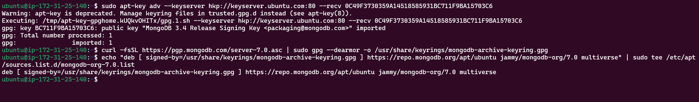

Update the package database and install MongoDB

$ sudo apt-get update

$ sudo apt-get install -y mongodb-org

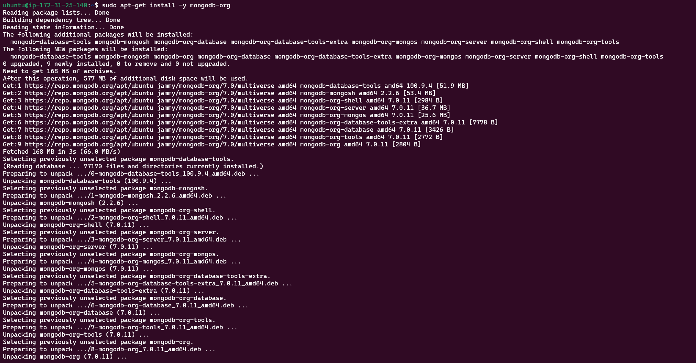

Start and enable MongoDB by running the following commands.

$ sudo systemctl start mongod

$ sudo systemctl enable mongod

$ sudo systemctl status mongod

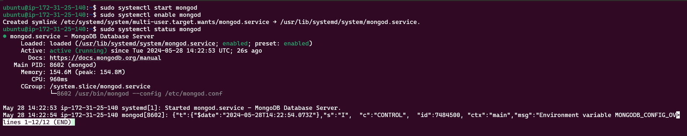

We need 'body-parser' package to help us process JSON files passed in requests to the server.

$ sudo npm install body-parser

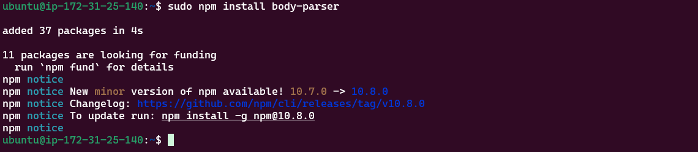

Create a folder named 'Books'

$ mdkir Books && cd Books

In the Books directory, intialize npm project

$ npm init

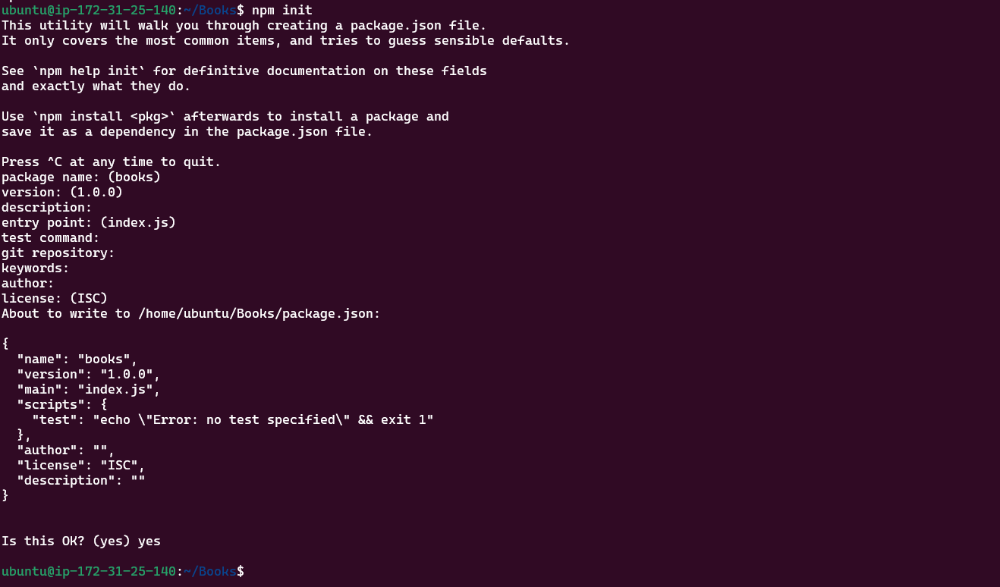

Add a file to it named server.js

$ vi server.js

Copy and paste the web server code below into the file.

````javascript
const express = require('express');
const bodyParser = require('body-parser');
const mongoose = require('mongoose'); // Make sure mongoose is installed and required
const path = require('path'); // To handle static file serving
const app = express();

// Connect to MongoDB
mongoose.connect('mongodb://localhost:27017/test', { useNewUrlParser: true, useUnifiedTopology: true })
.then(() => console.log('MongoDB connected'))
.catch(err => console.error('MongoDB connection error:', err));

// Middleware
app.use(bodyParser.json());
app.use(express.static(path.join(\_\_dirname, 'public')));

// Routes
require('./apps/routes')(app);

// Start the server
app.set('port', 3300);
app.listen(app.get('port'), () => {
console.log('Server up: http://localhost:' + app.get('port'));
});

Step 3: Install Express and set up routes to the server

Express was used to pass book information to and from our MongoDB database. Mongoose package provides a straightforward schema-based solution to model the application data. Mongoose was used to establish a schema for the database to store data of the book register.

Install express and mongoose by running the commaand below.

$ sudo npm install express mongoose

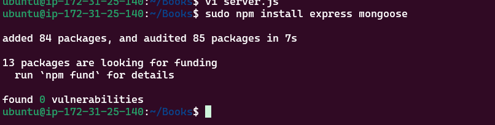

In 'Books' folder, create a folder named apps

$ mkdir apps && cd apps

Create a file named routes.js

$ vi routes.js

Copy and paste the code below into that file.

```javascript
const Book = require('./models/book');
const path = require('path');

module.exports = function(app) {
// Get all books
app.get('/book', async (req, res) => {
try {
const books = await Book.find({});
res.json(books);
} catch (err) {
console.error(err);
res.status(500).json({ error: 'Internal Server Error' });
}
});

// Add a new book
app.post('/book', async (req, res) => {
try {
const book = new Book({
name: req.body.name,
isbn: req.body.isbn,
author: req.body.author,
pages: req.body.pages
});
const result = await book.save();
res.json({
message: "Successfully added book",
book: result
});
} catch (err) {
console.error(err);
res.status(500).json({ error: 'Internal Server Error' });
}
});

// Update a book
app.put('/book/:isbn', async (req, res) => {
try {
const updatedBook = await Book.findOneAndUpdate(
{ isbn: req.params.isbn },
req.body,
{ new: true }
);
if (!updatedBook) {
return res.status(404).json({ error: 'Book not found' });
}
res.json({
message: "Successfully updated the book",
book: updatedBook
});
} catch (err) {
console.error(err);
res.status(500).json({ error: 'Internal Server Error' });
}
});

// Delete a book
app.delete('/book/:isbn', async (req, res) => {
try {
const result = await Book.findOneAndRemove({ isbn: req.params.isbn });
if (!result) {
return res.status(404).json({ error: 'Book not found' });
}
res.json({
message: "Successfully deleted the book",
book: result
});
} catch (err) {
console.error(err);
res.status(500).json({ error: 'Internal Server Error' });
}
});

// Serve static files
app.get('\*', (req, res) => {
res.sendFile(path.join(\_\_dirname, '../public', 'index.html'));
});
};

In the 'apps' folder, create a folder named models

$ mkdir models && cd models

Create a file named book.js

$ vi book.js

Copy and paste the code below into 'book.js'

```javascript
const mongoose = require('mongoose');

const bookSchema = new mongoose.Schema({
name: { type: String, required: true },
isbn: { type: String, required: true, unique: true },
author: { type: String, required: true },
pages: { type: Number, required: true }
});

module.exports = mongoose.model('Book', bookSchema);

Step 4 - Access the routes with AngularJS

In this project, AngularJS was used to connect the web page with Express and perform actions on the book register.

Change the directory back to 'Books'

$ cd ../..

Create a folder named public

$ mkdir public && cd public

Add a file named script.js

$ vi script.js

Copy and paste the code below into that file created.

var app = angular.module('myApp', []);

app.controller('myCtrl', function($scope, $http) {
// Get all books
function getAllBooks() {
$http({
method: 'GET',
url: '/book'
}).then(function successCallback(response) {
$scope.books = response.data;
}, function errorCallback(response) {
console.log('Error: ' + response.data);
});
}

// Initial load of books
getAllBooks();

// Add a new book
$scope.add_book = function() {
var body = {
name: $scope.Name,
isbn: $scope.Isbn,
author: $scope.Author,
pages: $scope.Pages
};
$http({
method: 'POST',
url: '/book',
data: body
}).then(function successCallback(response) {
console.log(response.data);
getAllBooks(); // Refresh the book list
// Clear the input fields
$scope.Name = '';
$scope.Isbn = '';
$scope.Author = '';
$scope.Pages = '';
}, function errorCallback(response) {
console.log('Error: ' + response.data);
});
};

// Update a book
$scope.update_book = function(book) {
var body = {
name: book.name,
isbn: book.isbn,
author: book.author,
pages: book.pages
};
$http({
method: 'PUT',
url: '/book/' + book.isbn,
data: body
}).then(function successCallback(response) {
console.log(response.data);
getAllBooks(); // Refresh the book list
}, function errorCallback(response) {
console.log('Error: ' + response.data);
});
};

// Delete a book
$scope.delete_book = function(isbn) {
$http({
method: 'DELETE',
url: '/book/' + isbn
}).then(function successCallback(response) {
console.log(response.data);
getAllBooks(); // Refresh the book list
}, function errorCallback(response) {
console.log('Error: ' + response.data);
});
};
});

In 'public' folder, create a file named index.html

$ vi index.html

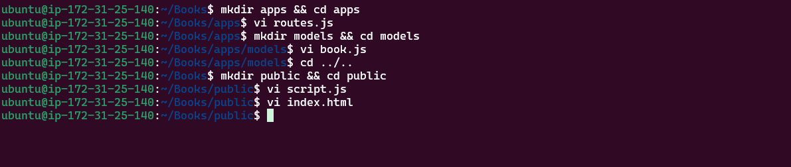

Change the directory back to 'Books'

$ cd ..

Start the server by running this command:

$ node server.js

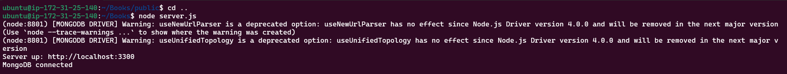

The server is now up and running, we can connect it via port 3300 which I created by creating an inbound rule on the aws console. It returned the HTML page.

Now I was able to access my Book Register web application from the internet with a browser using Public IP address as shown below.

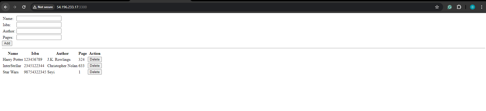
````
