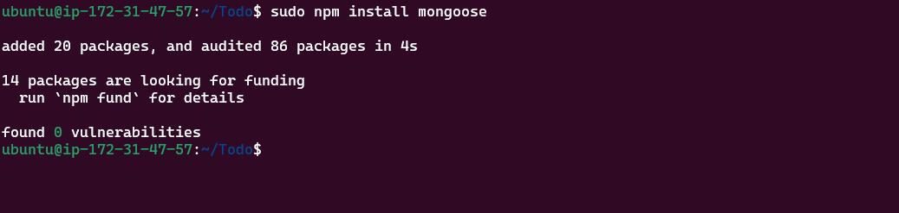
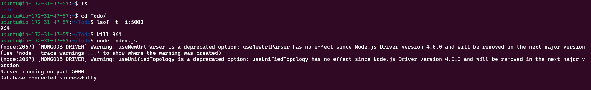
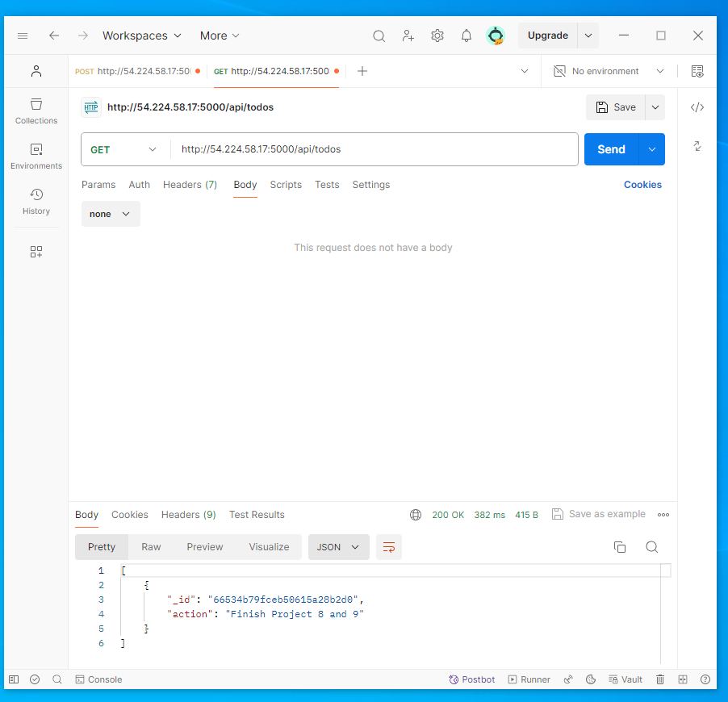

MERN WEB STACK IMPLEMENTATION IN AWS

Step 0: Prerequisites

EC2 Instance of t3.small type and Ubuntu 24.04 LTS (HVM) was lunched in the us-east-1 region using the AWS console. The choice of the instance type was based on the following:

Memory: The t3.small instance offers more memory than the t2.micro, which is advantageous for applications that require more memory to operate efficiently.

Burst Capability: While both instances offer burstable CPU performance, the t3 instances have a more flexible burst model, allowing for more sustained performance during burst periods. This is important for workloads that require consistent performance over longer periods.

Performance: While both instances offer burstable performance, the t3.small typically provides better baseline performance compared to the t2.micro. This might be necessary for applications that require a bit more processing power.


Attached SSH key named my-ec2-key to access the instance on port 22

The security group was configured with the following inbound rules:

Allow traffic on port 80 (HTTP) with source from anywhere on the internet.

Allow traffic on port 443 (HTTPS) with source from anywhere on the internet.

Allow traffic on port 22 (SSH) with source from any IP address. This is opened by default.

Allow traffic on port 5000 (Custom TCP) with source from anywhere.

Allow traffic on port 3000 (Custom TCP) with source from anywhere.


Update ubuntu and check for upgrades using the apt manager by running the following command sudo apt update


Install Node.js on the server by running the command: sudo apt-get install -y nodejs


This installs both nodejs and npm (which is a package manager for node used to install modules and packages and manage depencendies)

Verify the node installation with the command: node -v


Verify installation npm installation with the command npm -v


Create a new directory for your To-Do project: mkdir Todo and run the command ls to confirm the creation of the directory.

Change the current directory to the project directory by running the command: cd Todo


Run the command npm init to initiaize the project which creates a new file package.json that contains information about the application and dependencies it needs. Press enter several times to accept the default values then type yes to accept to write out the package.json file


Run the command ls to confirm the file has been created in the directory

Install ExpressJS

After installing Nodejs and NPM manager it is important to install ExpressJS which is the framework for NodeJS.

To install ExpressJS, use npm by running the command: npm install express


Create a file index.js with the command: touch index.js and run the command ls to confirm the file has been created in the directory:

Install dotenv module by running the command: npm install dotenv

Open the index.js file with the command: vim index.js

Type the code below into the file and save:

const express = require('express');
require('dotenv').config();

const app = express();

const port = process.env.PORT || 5000;

app.use((req, res, next) => {
        res.header("Access-Control-Allow-Origin", "\*");
        res.header("Access-Control-Allow-Headers", "Origin, X-Requested-With, Content-Type, Accept");
        next();
});

app.use((req, res, next) => {
        res.send('Welcome to Express');
});

app.listen(port, () => {
        console.log(`Server running on port ${port}`)
});

In the same directory as your index.js file, start the server by running the command: 

$ node index.js


If everything goes well, the message Server running on port 5000 should display

Create an inbound rule to open TCP port 5000 by running the command: sudo ufw allow 5000/tcp or by adding an inbound rule through the Amazon console


Open up your browser and access the servers Public IP or Public DNS and followed by port 5000:


Routes

Three tasks will be created for the To-do app which include, creating new tasks, displaying all tasks and deleting complete tasks. This will make use of different enpoints linked to standard HTTP request methods: POST, GET, DELETE. routes are then created that will define various endpoints that the app will depend on.

Create a folder routes by running the command: mkdir routes

Change Directory to the routes folder and create a file called api.js with the command: touch api.js and open the api.js file by running the command: vim api,js:

Write the below code into the file and save:

const express = require ('express');
const router = express.Router();

router.get('/todos', (req, res, next) => {

});

router.post('/todos', (req, res, next) => {

});

router.delete('/todos/:id', (req, res, next) => {

})

module.exports = router;

Models

Models are at the heart of JavaScript applications which makes it interractive. Models are also used to define the database schema which essentially defines the fields stored in each Mongodb document. To create a schema and a model, install mongoose which is a Nodejs package that makes working with mongodb easier.

Change working directory to Todo folder and install Mongoose: 
$ npm install mongoose



Create a new folder using the ``mkdir modelscommand and change the working directory to the newly createdmodels``` folder:

Inside the models folder create a file todo.js by running the command touch todo.js and open the file in the editor by running the command vim todo.js

Write the code in the file:

const mongoose = require('mongoose');
const Schema = mongoose.Schema;

//create schema for todo
const TodoSchema = new Schema({
        action: {
                type: String,
                required: [true, 'The todo text field is required']
        }
})

//create model for todo
        const Todo = mongoose.model('todo', TodoSchema);

module.exports = Todo;

In routes directory, open api.js in the text editor and replace the code with the following:

const express = require ('express');
const router = express.Router();
const Todo = require('../models/todo');

router.get('/todos', (req, res, next) => {

//this will return all the data, exposing only the id and action field to the client
Todo.find({}, 'action')
.then(data => res.json(data))
.catch(next)
});

router.post('/todos', (req, res, next) => {
if(req.body.action) {
Todo.create(req.body)
.then(data => res.json(data))
.catch(next)
}else {
res.json({
error: "The input field is empty"
})
}
});
router.delete('/todos/:id', (req, res, next) => {
Todo.findOneAndDelete({"_id": req.params.id})
.then(data = > res.json(data))
.catch(next)
})

module.exports = router;

MongoDB Database

A database is required for storing our data and we will make use of mLab which provides MongoDB database as a service. Sign up to mLab and deloy a shared cluster free account, choose AWS cloud provider and a region near you.


Allow access to the Database from anywhere and change the time of deleting the entry from 6 Hours to 1 week:

Create a database user 'seyi' and password 'passw0rd1'

Create a MongoDB database and collection inside mLab:


Create a file in your Todo directory and name it .env by running the code 

$ touch.env 
$  vi .env

Add connection string to access the database into the newly created .env file while adding your , , and accordingly: 

DB = 'mongodb+srv://<username>:<password>@<network-address>/<dbname>?retryWrites=true&w=majority'


Update the index.js to reflect the use of .env so that Node.js can connect to the database by editing the content of the file to the following code:

const express = require('express');
const bodyParser = require('body-parser');
const mongoose= require('mongoose');
const routes = require('./routes/api');
const path = require('path');
require('dotenv').config();

const app = express();

const port = process.env.PORT || 5000;

//connect to the database
mongoose.connect(process.env.DB, { useNewUrlParser: true, useUnifiedTopology: true })
.then(() => console.log(`Database connected successfully`))
.catch(err => console.log(err));

//since mongoose promise is depreciated, we override it with node's promise
mongoose.Promise = global.Promise;

app.use((req, res, next) => {
        res.header("Access-Control_Allow-Origin", "\*");
        res.header("Access-Control-Allow-Headers", "Origin, X-Requested-With, Content-Type, Accept");
});

app.use(bodyParser.json());

app.use('/api', routes);

app.use((err, req, res, next) => {
        console.log(err);
        next();
});

app.listen(port, () => {
        console.log(`Server running on port ${port}`)
});

Using environmental variables store information is considered a secure best practice instead of entering that configuration information directly into the index.js file. Start the server using 

$ node index.js



Testing Backend Code without Frontend using RESTful API

The backend part of the To-Do application has been written and a database has been configured but a frontend UI is yet to be implemented. ReactJS will be used to acheive the frontend. However, theres a need to test our code using RESTful API, in this case, we use an API development client to test our code.

Download and install postman

Next is to test the API endpoints to be sure they are working properly:

Create a POST request to the API: http://<PublicIP-or-PublicDNS>:5000/api/todos. It is also important to enter the body of the request with the content of the new task to be posted into the database:


Create a GET request to the API: http://<PublicIP-or-PublicDNS>:5000/api/todos which will retreive all existing records from the database.



Create a DELETE request to the API: http://<PublicIP-or-PublicDNS>:5000/api/todos/<id-of-task> which will delete an existing record from the database using the id as an identifier of the record.


Frontend Creation
It is time to create a user interface for a Web client (browser) to interact with the application via API

In the same root directory as your backend code, which is the Todo directory, run:

$ npx create-react-app client


This created a new folder in the Todo directory called client, where all the react code was added.

Running a React App
Before testing the react app, the following dependencies needs to be installed in the project root directory.

Install concurrently, which is used to run more than one command simultaneously from the same terminal window.

$ npm install concurrently --save-dev


Install nodemon. It is used to run and monitor the server. If there is any change in the server code, nodemon will restart it automatically and load the new changes.

$ npm install nodemon --save-dev


In Todo folder open the package.json file, change the highlighted part of the below screenshot and replace with the code below:

"scripts": {
  "start": "node index.js",
  "start-watch": "nodemon index.js",
  "dev": "concurrently \"npm run start-watch\" \"cd client && npm start\""
}

Configure Proxy In package.json

Change directory to “client”

$ cd client

Open the package.json file

$ vi package.json

Add the key value pair in the package.json file

“proxy”: “http://localhost:5000”

The whole purpose of adding the proxy configuration above is to make it possible to access the application directly from the browser by simply calling the server url like http://locathost:5000 rather than always including the entire path like http://localhost:5000/api/todos

Ensure you are inside the Todo directory, and simply do:

$ npm run dev


The app opened and started running on localhost:3000

Note: In order to access the application from the internet, TCP port 3000 had been opened on EC2.

Creating React Components

One of the advantages of react is that it makes use of components, which are reusable and also makes code modular. For the Todo app, there are two stateful components and one stateless component. From Todo directory, run:

$ cd client

Move to the “src” directory

$ cd src

Inside your src folder, create another folder called “components”

$ cd components

Inside the ‘components’ directory create three files “Input.js”, “ListTodo.js” and “Todo.js”.

$ touch Input.js ListTodo.js Todo.js

Open Input.js file

$ vi Input.js

Paste in the following:

import React, { Component } from 'react';
import axios from 'axios';

class Input extends Component {
  state = {
    action: ""
  }

  handleChange = (event) => {
    this.setState({ action: event.target.value });
  }

  addTodo = () => {
    const task = { action: this.state.action };

    if (task.action && task.action.length > 0) {
      axios.post('/api/todos', task)
        .then(res => {
          if (res.data) {
            this.props.getTodos();
            this.setState({ action: "" });
          }
        })
        .catch(err => console.log(err));
    } else {
      console.log('Input field required');
    }
  }

  render() {
    let { action } = this.state;

    return (
      <div>
        <input type="text" onChange={this.handleChange} value={action} />
        <button onClick={this.addTodo}>add todo</button>
      </div>
    );
  }
}

export default Input;

In oder to make use of Axios, which is a Promise based HTTP client for the browser and node.js, you need to cd into your client from your terminal and run yarn add axios or npm install axios.

Move to the client folder

$ cd ../..

Install Axios

$ npm install axios


Go to components directory

$ cd src/components

After that open the ListTodo.js

$ vi ListTodo.js

Copy and paste the following code:

import React from 'react';

const ListTodo = ({ todos, deleteTodo }) => {
  return (
    <ul>
      {
        todos && todos.length > 0 ? (
          todos.map(todo => {
            return (
              <li key={todo._id} onClick={() => deleteTodo(todo._id)}>
                {todo.action}
              </li>
            );
          })
        ) : (
          <li>No todo(s) left</li>
        )
      }
    </ul>
  );
}

export default ListTodo;

Then in the Todo.js file, write the following code

$ vi Todo.js

import React, { Component } from 'react';
import axios from 'axios';

import Input from './Input';
import ListTodo from './ListTodo';

class Todo extends Component {
  state = {
    todos: []
  }

  componentDidMount() {
    this.getTodos();
  }

  getTodos = () => {
    axios.get('/api/todos')
      .then(res => {
        if (res.data) {
          this.setState({
            todos: res.data
          });
        }
      })
      .catch(err => console.log(err));
  }

  deleteTodo = (id) => {
    axios.delete(`/api/todos/${id}`)
      .then(res => {
        if (res.data) {
          this.getTodos();
        }
      })
      .catch(err => console.log(err));
  }

  render() {
    let { todos } = this.state;
    return (
      <div>
        <h1>My Todo(s)</h1>
        <Input getTodos={this.getTodos} />
        <ListTodo todos={todos} deleteTodo={this.deleteTodo} />
      </div>
    );
  }
}

export default Todo;

Move to src folder

$ cd ..

Ensure to be in the src folder and run:

$ vi App.js

Copy and paste the following code

import React from 'react';
import Todo from './components/Todo';
import './App.css';

const App = () => {
  return (
    <div className="App">
      <Todo />
    </div>
  );
}

export default App;

In the src directory, open the App.css

$ vi App.css

Paste the following code into it

.App {
  text-align: center;
  font-size: calc(10px + 2vmin);
  width: 60%;
  margin-left: auto;
  margin-right: auto;
}

input {
  height: 40px;
  width: 50%;
  border: none;
  border-bottom: 2px #101113 solid;
  background: none;
  font-size: 1.5rem;
  color: #787a80;
}

input:focus {
  outline: none;
}

button {
  width: 25%;
  height: 45px;
  border: none;
  margin-left: 10px;
  font-size: 25px;
  background: #101113;
  border-radius: 5px;
  color: #787a80;
  cursor: pointer;
}

button:focus {
  outline: none;
}

ul {
  list-style: none;
  text-align: left;
  padding: 15px;
  background: #171a1f;
  border-radius: 5px;
}

li {
  padding: 15px;
  font-size: 1.5rem;
  margin-bottom: 15px;
  background: #282c34;
  border-radius: 5px;
  overflow-wrap: break-word;
  cursor: pointer;
}

@media only screen and (min-width: 300px) {
  .App {
    width: 80%;
  }

  input {
    width: 100%;
  }

  button {
    width: 100%;
    margin-top: 15px;
    margin-left: 0;
  }
}

@media only screen and (min-width: 640px) {
  .App {
    width: 60%;
  }

  input {
    width: 50%;
  }

  button {
    width: 30%;
    margin-left: 10px;
    margin-top: 0;
  }
}

In the src directory, open the index.css

$ vi index.css

Copy and paste the code below:

body {
  margin: 0;
  padding: 0;
  font-family: -apple-system, BlinkMacSystemFont, "Segoe UI", "Roboto", "Oxygen", "Ubuntu", "Cantarell", "Fira Sans", "Droid Sans", "Helvetica Neue", sans-serif;
  -webkit-font-smoothing: antialiased;
  -moz-osx-font-smoothing: grayscale;
  box-sizing: border-box;
  background-color: #282c34;
  color: #787a80;
}

code {
  font-family: source-code-pro, Menlo, Monaco, Consolas, "Courier New", monospace;
}

Go to the Todo directory

$ cd ../..

Run:

$ npm run dev


At this point, the To-Do app is ready and fully functional with the functionality discussed earlier: Creating a task, deleting a task, and viewing all the tasks.

The client can now be viewed in the browser


Conclusion

By following this documentation and leveraging the provided resources, one is well-equipped to build and deploy full-fledged web applications utilizing the MERN stack.