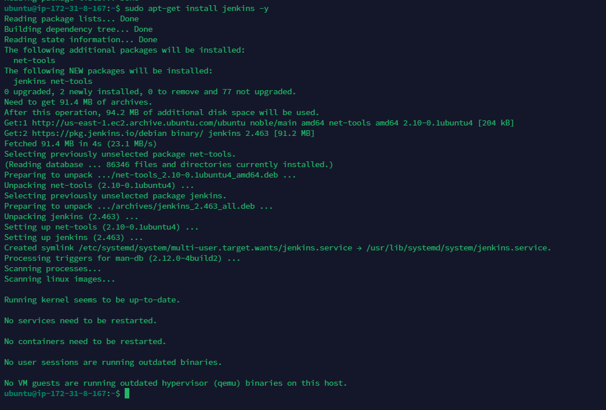
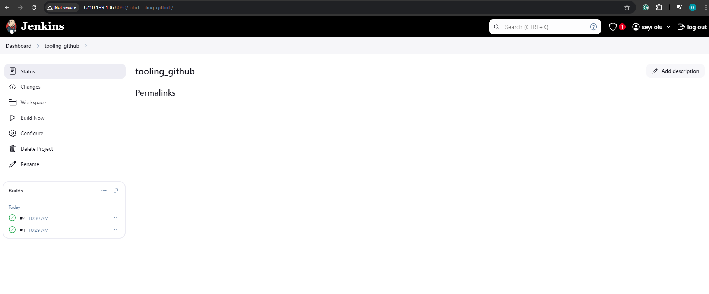
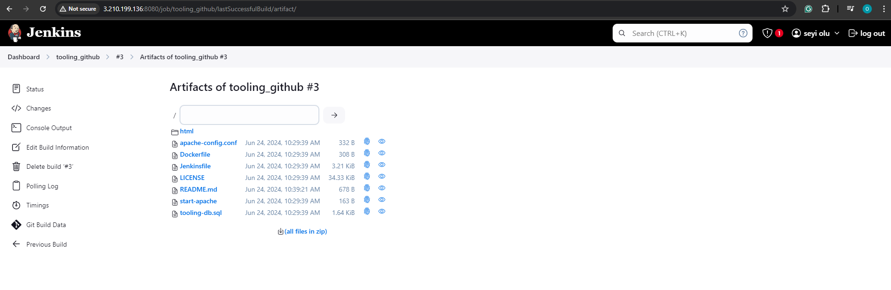
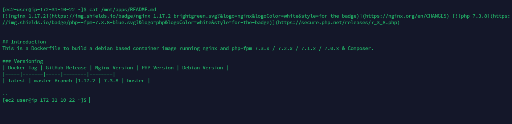

# Tooling Website deployment automation with Continuous Integration using Jenkins

## Task

Enhance the architecture prepared in the previous project by adding a Jenkins server, configure a job to automatically deploy source codes changes from Git to NFS server.

## Step 1 - Install Jenkins server

### 1. Create an aws EC2 instance based on Ubuntu Server 24.04 LTS and name it Jenkins


### 2. Install JDK since Jenkins is a Java-based application

#### SSH into the instance

#### Update the Instance

`sudo apt-get update`


#### Download the Jenkins key

```
sudo wget -O /usr/share/keyrings/jenkins-keyring.asc \
  https://pkg.jenkins.io/debian/jenkins.io-2023.key
```


#### Add the Jenkins Repository

```
echo "deb [signed-by=/usr/share/keyrings/jenkins-keyring.asc]" \
  https://pkg.jenkins.io/debian binary/ | sudo tee \
  /etc/apt/sources.list.d/jenkins.list > /dev/null
```


#### Install Java

Jenkins requires Java to run, yet not all Linux distributions include Java by default. Additionally, not all Java versions are compatible with Jenkins. Install `OpenJDK 17`

`sudo apt install fontconfig openjdk-17-jre`

### 3. Install Jenkins

#### Update Ubuntu

`sudo apt-get update`

#### Install Jenkins

`sudo apt-get install jenkins -y`



#### Ensure Jenkins is up and running

```
sudo systemctl enable jenkins
sudo systemctl start jenkins
sudo systemctl status jenkins
```


### 4. By default Jenkins server uses TCP port 8080 - open it by creating a new Inbound rule in the EC2 Security Group


### 5. Perform initial Jenkins setup

From a browser access `http://<Jenkins-Server-Public-IP-Address>:8080` You will be prompted to provide a default admin password. Retrieve it from the server.

`http://3.210.199.136:8080`

`sudo cat /var/lib/jenkins/secrets/initialAdminPassword`


#### Copy the password that displays as out put and paste it into your jenkins page opened in the browser, you should get the same output below :

 

#### Install suggested plugins and wait for the installation to be complete, then create an admin user and password, when this is done, you will get the jenkins server address


## Step 2 - Configure Jenkins to retrieve source codes from GitHub using Webhooks

### 1. Enable webhooks in your github repo settings

- Navigate to your github repository page

- Click on settings, scroll down and click on webhooks

- Click on add webhook

- in the form field for payload URL as shown below:

`http://<jenkins-server-address:8080/github-webhook/`

- Set content type to `application/json`
  

### 2. Log into your jenkins server

- Select new item from the side nav bar

- Input your desired name tooling , and select freestye project from the list below it
  under source code management, Choose Git repository and input your github repository link, also enter your github username and password.

- set branch to build as `main`. (ie) `*/main` and save the configuration.

- Click on `build now` button to build


To connect our GitHub repository, we will need to provide its URL, we can copy from the repository itself.

`https://github.com/francdomain/tooling.git`

In configuration of our Jenkins freestyle project choose Git repository, provide there the link to our Tooling GitHub repository and credentials (user/password) so Jenkins could access files in the repository.


Save the configuration and try to run the build. For now we can only do it manually. Click Build Now button. After all was configured correctly, the build was successfull and was seen under #3 You can open the build and check in Console Output if it has run successfully.



But this build does not produce anything and it runs only when we trigger it manually. Let us fix it.

### 3. Click Configure our job/project and add these two configurations

Configure `triggering the job from GitHub webhook` and also Configure `Post-build Actions` to `archive all the files` - files resulted from a build are called artifacts:

Now, go ahead and make some change in any file in our GitHub repository (e.g. README.MD file) and push the changes to the main branch.


we will see that a new build has been launched automatically by webhook and its results - artifacts, saved on Jenkins server.



Now we configured an automated Jenkins job that receives files from GitHub by webhook trigger this method is considered as push because the changes are being pushed and files transfer is initiated by GitHub. There are also other methods: `trigger one job (downstreadm) from another (upstream)`, `poll GitHub periodically` and others.

By default, the artifacts are stored on Jenkins server locally

`ls /var/lib/jenkins/jobs/tooling_github/builds/<build_number>/archive/`


## Step 3 - Configure Jenkins to copy files to NFS server via SSH

Now we have our artifacts saved locally on Jenkins server, the next step is to copy them to our NFS server to /mnt/apps directory.

Jenkins is a highly extendable application and there are more than 1400 plugins available. now we will need a plugin that is called Publish Over SSH

### 1. Install Publish Over SSH plugin.

On main dashboard, Select Manage Jenkins > Manage Plugins > Available > Search for Publish over SSH and Install without restart.


### 2. Configure the job/project to copy artifacts over to NFS server

On main dashboard select `Manage Jenkins > Configure System` menu item.

Scroll down to Publish over SSH plugin configuration section and configure it to be able to connect to your NFS server:

Provide a `private key` (content of .pem file that we use to connect to NFS server via SSH/Putty)

Arbitrary name

Hostname - can be `private IP address` of our `NFS` server

Username - `ec2-user` (since NFS server is based on EC2 with RHEL 9)

Remote directory -` /mnt/apps` since our Web Servers use it as a mointing point to retrieve files from the NFS serve

Test the configuration and make sure the connection returns Success. N.B that TCP port 22 on NFS server must be open to receive SSH connections


Save the configuration, open your Jenkins job/project configuration page and add another one Post-build Action (`Send build artifact over ssh`).

Also, Configure it to send all files produced by the build into our previouslys define remote directory In our case we want to copy all files and directories, so we use \*\* If you want to apply some particular pattern to define which files to send


Save this configuration and go ahead, change something in README.MD file in our GitHub Tooling repository


The line created previously in the README.md file have been removed

Webhook will trigger a new job


The error in the build #4 above indicates that we need to set permissions for user ec2-user on the NFS server : Ensure the target directory (/mnt) and it's contents on the NFS server has the correct permissions. We might need to change ownership or modify the permissions to allow the Jenkins user to write to it.

```
sudo chown -R ec2-user:ec2-user /mnt/apps
sudo chmod -R 777 /mnt/apps
```

#### Run the build again from jenkins GUI

Webhook triggers a new job and in the Console Output of the job we get something like this:

```
SSH: Transferred 24 file(s)
Finished: SUCCESS
```


To make sure that the files in `/mnt/apps` have been updated - connect via SSH to our NFS Server and verify README.MD file

`cat /mnt/apps/README.md`


