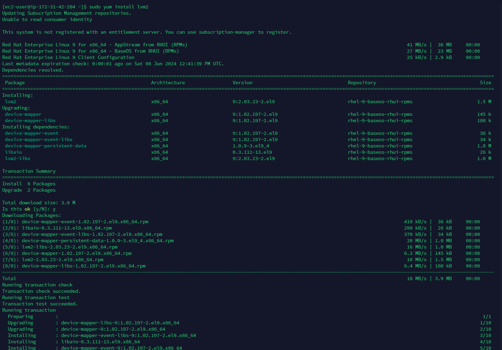

# Web Solution with WordPress

## Step 1 - Prepare a Web Server

#### 1. Launch a RedHat EC2 instance that serve as Web Server. Create 3 volumes in the same AZ as the web server ec2 each of 10GB and attache all 3 volumes one by one to the web server.


#### 2. Open up the Linux terminal to begin configuration.

#### 3. Use lsblk to inspect what block devices are attached to the server. All devices in Linux reside in /dev/ directory. Inspect with ls /dev/ and ensure all 3 newly created devices are there.

`lsblk`


#### 4. Use df -h to see all mounts and free space on the server.

`df -h`

#### 5a. Use gdisk utility to create a single partition on each of the 3 disks.

`sudo gdisk /dev/nvme1n1`


`sudo gdisk /dev/nvme2n1`


`sudo gdisk /dev/nvme3n1`


#### 5b. Use lsblk utility to view the newly configured partitions on each of the 3 disks

`lsblk`


#### 6. Install lvm package

`sudo yum install lvm2 -y`



#### 7. Use pvcreate utility to mark each of the 3 dicks as physical volumes (PVs) to be used by LVM. Verify that each of the volumes have been created successfully.

`sudo pvcreate /dev/nvme1n1p1 /dev/nvme2n1p1 /dev/nme3n1p1`

`sudo pvs`

#### 8. Use vgcreate utility to add all 3 PVs to a volume group (VG). Name the VG webdata-vg. Verify that the VG has been created successfully.

`sudo vgcreate webdata-vg /dev/nvme1np1 /dev/nvme2n1p1 /dev/nvme3n1p1`

`sudo vgs`


#### 9. Use lvcreate utility to create 2 logical volume, apps-lv (Use half of the PV size), and logs-lv (Use the remaining space of the PV size). Verify that the logical volumes have been created successfully.

```
sudo lvcreate -n apps-lv -L 14G webdata-vg

sudo lvcreate -n logs-lv -L 14G webdata-vg

sudo lvs
```


#### 10a. Verify the entire setup

`sudo vgdisplay -v #view complete setup, VG, PV and LV`


`lsblk`


#### 10b. Use mkfs.ext4 to format the logical volumes with ext4 filesystem

```
sudo mkfs.ext4 /dev/webdata-vg/apps-lv

sudo mkfs.ext4 /dev/webdata-vg/logs-lv
```


#### 11. Create /var/www/html directory to store website files and /home/recovery/logs to store backup of log data

```
sudo mkdir -p /var/www/html
sudo mkdir -p /home/recovery/logs
```

Mount /var/www/html on apps-lv logical volume

`sudo mount /dev/webdata-vg/apps-lv /var/www/html`

#### 12. Use rsync utility to backup all the files in the log directory /var/log into /home/recovery/logs (This is required before mounting the file system)

`sudo rsync -av /var/log /home/recovery/logs`


#### 13. Mount /var/log on logs-lv logical volume (All existing data on /var/log is deleted with this mount process which was why the data was backed up).

`sudo mount /dev/webdata-vg/logs-lv /var/log`

#### 14. Restore log file back into /var/log directory

`sudo rsync -av /home/recovery/logs/log/ /var/log`


#### 15. Update /etc/fstab file so that the mount configuration will persist after restart of the server

##### Get the UUID of the device and Update the /etc/fstab file with the format shown inside the file using the UUID. Remember to remove the leading and ending quotes.

```
sudo blkid   # To fetch the UUID

sudo vi /etc/fstab
```


#### 16. Test the configuration and reload daemon. Verify the setup

```
sudo mount -a   # Test the configuration

sudo systemctl daemon-reload

df -h   # Verifies the setup
```


## Step 2 - Prepare the Database Server

We can now proceed to installing and configuring MYSQL server that will serve as the database for our website on the server instance, to do this, we can follow same process as we did in the server instance to create ec2 instance, create and attach the 3 ebs volumes, ssh into your instance and create partitions.

#### 1. Create logical volumes, ( use same process as we did in the server instance, the logical volume should be db-lv instead of apps-lv, alos create logs-lv

#### 2. Mount the db-lv to /db/ directory

## Step 3- Install WordPress on your Web Server EC2

#### 1. Update the repository

`sudo yum -y update`

#### 2. Install wget, Apache and its dependencies

`sudo yum -y install wget httpd php php-mysqlnd php-fpm php-json`

#### 3. Start Apache

```
sudo systemctl enable httpd

sudo systemctl start httpd

sudo systemctl status httpd
```

#### 4. To install PHP and it's dependencies

```
sudo yum install https://dl.fedoraproject.org/pub/epel/epel-release-latest-9.noarch.rpm
sudo yum install yum-utils http://rpms.remirepo.net/enterprise/remi-release-9.rpm
sudo yum module list php sudo yum module reset php
sudo yum module enable php:remi-8.2
sudo yum install php php-opcache php-gd php-curl php-mysqlnd
sudo systemctl start php-fpm
sudo systemctl enable php-fpm setsebool -P httpd_execmem 1
```

#### 5. Restart Apache

`sudo systemctl restart httpd`

#### 6. Configured a php page to test my configuration is okay

`sudo vi /var/www/html/info.php`


#### 7. Visit your IPaddress/info.php


#### 8. Download and Copy wordpress to the /var/www/html directory

```
sudo wget http://wordpress.org/latest.tar.gz
sudo tar xzvf latest.tar.gz
sudo rm -rf latest.tar.gz
sudo cp wordpress/wp-config-sample.php wordpress/wp-config.php
```

#### 9. Configure SElinux policies

```
sudo chown -R apache:apache /var/www/html/wordpress
sudo chcon -t httpd_sys_rw_content_t /var/www/html/wordpress -R
sudo setsebool -P httpd_can_network_connect=1
```

## Step 4 - Install MySQL on your DB Server EC2

```
sudo yum -y update
sudo yum install mysql-server
```

#### Verify that the service is up and running. If it is not running, restart the service and enable it so it will be running even after reboot.

```
sudo systemctl start mysqld
sudo systemctl enable mysqld
sudo systemctl status mysqld
```

## Step 5 - Configure the DB to work with wordpress , you can do this by creating a DB user that is from the web server IP address.

##### Run the command to sign in as a root user:

`sudo mysql`

```
CREATE DATABASE wordpress_db;
CREATE USER 'seyi'@'172.31.42.204' IDENTIFIED BY 'passw0rd123$';
GRANT ALL ON wordpress_db.* TO 'wordpress'@'172.31.42.204' WITH GRANT OPTION;
FLUSH PRIVILEGES;
show databases;
exit
```


## Step 6 - Configure WordPress to connect t remote database.

Test your db connection by logging in to your db from your webserver, before that, ensure you allowed port 3306 (which is the default port for mysql) in your mysql instance inbound rules, configure the connection to your-webserver-IP-address/32


#### Then access your webserver instance and also install mysql client

`sudo yum install -y mysql`

#### Log in to the mysql server remotely from your webserver

`sudo mysql -u myuser -p -h (your mysql server ip address)`


### Now that you have successfully setup and configured mysql and connected to it remotely from your webserver, it is essential we set up wordpress to do the same.

I accessed ip-address/wordpress in my web browser and you should get the same result as below

## Step 7

#### Log into your webserver ec2 instance and access your wordpress directory

`sudo cd /var/html/wordpress`

#### Configure wordpress to use your mysql database we created earlier, to do this , we have to access the wp-config file , this is where the configuration of wordpress is done

`sudo vi wp-config.php`

replace the variables of DB user, DB host, DB password.

DB host - this should be your mysql server ip address.

DB password ; your database password.

DB user ; the database user we created earlier.


#### Save aand exit.

#### Visit your webserver IP address/wordpress directory

`your-ip-address/wordpress`


### Conclusion

In this documentation, we learnt how to create and attach ebs volumes to our instance, partion and create logical volumes to store our wordpress website, we have also been able to create a wordpress website, hosted the website files on our apache webserver and hosted the database on another server and was able to connect remotely into it.
